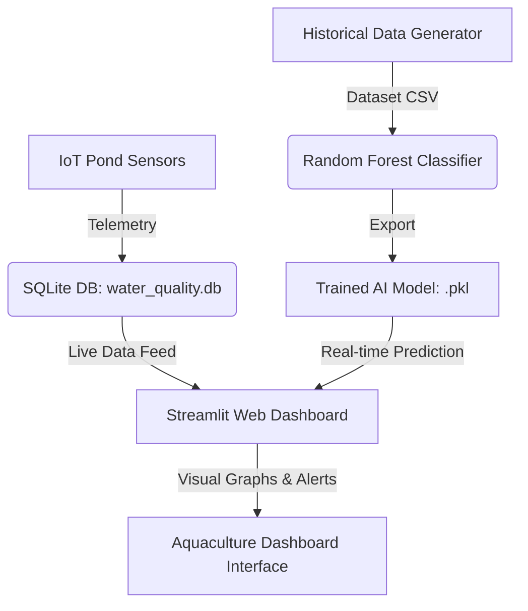

# IoT Water Quality Prediction for Sustainable Aquaculture Using AI

[](https://gaganmn.streamlit.app)

🚀 **Live Deployed Web Application**: [gaganmn.streamlit.app](https://gaganmn.streamlit.app)

This repository contains a fully runnable academic major project simulating an IoT-enabled aquaculture monitoring system. It uses simulated water sensors (Temperature, pH, Dissolved Oxygen, Turbidity, Conductivity, Ammonia) combined with a Machine Learning classifier to predict water quality health status (Optimal, Warning, Critical) and recommend corrective farming interventions.

---

## 🏗️ Project Architecture & Workflow



1. **`data_simulator.py`**: Simulates physical IoT nodes by publishing readings into an SQLite database (`water_quality.db`) using a random-walk algorithm, and generates training CSV data.
2. **`train_model.py`**: Reads historical CSV data, trains a Random Forest classification model using `scikit-learn`, and saves the model parameters (`water_quality_model.pkl`, `scaler.pkl`).
3. **`app.py`**: A reactive Streamlit-based web dashboard that visualizes real-time sensor charts, runs the ML model to predict pond health, and provides actionable recommendations (e.g. pond aeration, water exchanges).

---

## 🚀 Getting Started

### 1. Installation & Setup

Ensure you have Python 3.8+ installed on your computer. Open your terminal inside this project's directory and execute:

```bash
# Install package dependencies
pip install -r requirements.txt
```

### 2. Generate Historical Data & Train the AI Model

Before starting the real-time simulation, you need to generate a training dataset and fit the Machine Learning model. Run:

```bash
# Step A: Generate historical CSV dataset (5000 rows by default)
python data_simulator.py --generate

# Step B: Train the Random Forest Classifier
python train_model.py
```

This will output the classification reports and save `water_quality_model.pkl` and `scaler.pkl`.

### 3. Launch the Live IoT Telemetry Simulator

In your terminal (or a new terminal window), start the live IoT telemetry feed which updates the SQLite database every 2 seconds:

```bash
python data_simulator.py --live
```

Keep this script running to feed continuous data into the dashboard!

### 4. Run the Streamlit Dashboard

In another terminal window, start the Streamlit web dashboard:

```bash
streamlit run app.py
```

Streamlit will automatically launch the dashboard in your default browser at `http://localhost:8501`.

---

## 💡 Key Features Demonstrable in Your Presentation

* **Two Modes**: 
  - **Live IoT Telemetry Feed**: Simulates a live aquaculture pond, showing metric cards, line charts, real-time predictions, and system diagnostics.
  - **Manual Prediction Playground**: Adjust sliders for temperature, pH, dissolved oxygen, turbidity, conductivity, and ammonia to show how the AI handles edge cases.
* **Smart Diagnostics**: When water quality degrades, the app details exactly which parameter triggered the alert and provides physical troubleshooting steps (e.g., lime treatment for pH, aeration for DO).
* **High-Accuracy RandomForest**: Machine Learning algorithm with a detailed classification output showing prediction confidence probabilities.
